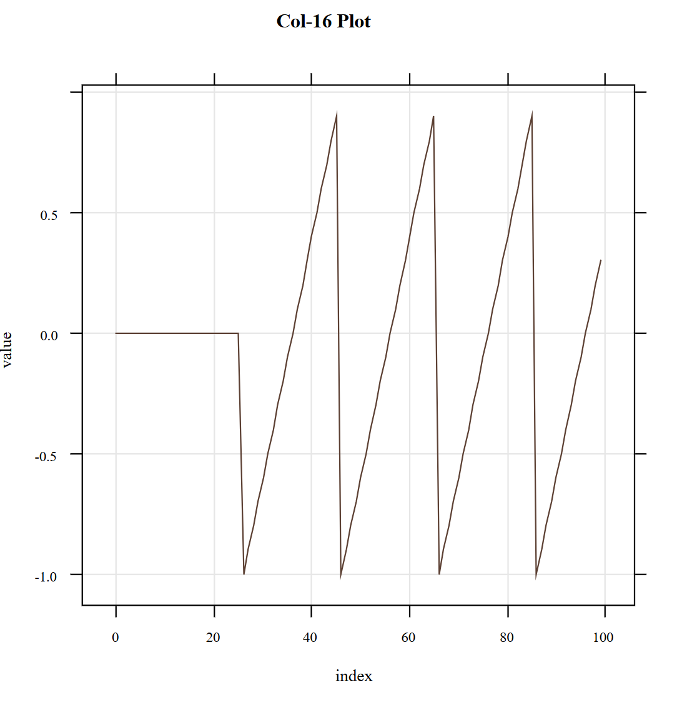

# SWE 307 – Big Data Project 1: Data Visualization using R

A Java Spring Boot web application that reads data from MongoDB and plots it in real time using an R function (`lattice::xyplot`) running on GraalVM. The plot is returned to the browser as an SVG image and refreshes automatically every second.

## Table of Contents

- [Overview](#overview)
- [Architecture](#architecture)
- [Features](#features)
- [Tech Stack](#tech-stack)
- [Prerequisites](#prerequisites)
- [Getting Started](#getting-started)
- [Usage](#usage)
- [Project Structure](#project-structure)
- [How It Works](#how-it-works)
- [Configuration](#configuration)
- [Troubleshooting](#troubleshooting)
- [Screenshot](#screenshot)
- [Course Information](#course-information)

## Overview

The application fetches one value per second from a MongoDB collection (column `Col-16` of the provided CSV file) and passes it from Java to an R plotting function through the GraalVM Polyglot API. R generates a line chart, and the resulting SVG is served to the browser. The chart behaves like a live sliding window over the last 100 values.

## Architecture

```
CSV ──(mongoimport)──► MongoDB ◄──(fetch)── Spring Boot + GraalVM Polyglot (R) ◄──(request, 1 sec)── Web Browser
```

| Component      | Implementation                                  |
|----------------|-------------------------------------------------|
| Data source    | `swe307_pro1.csv` (100 rows)                    |
| Database       | MongoDB (`swe307` database, `data` collection)  |
| Backend        | Spring Boot 2.1.12 with embedded Tomcat         |
| Plotting       | R (FastR) on GraalVM, `lattice::xyplot()`       |
| Client         | Web browser (auto-refresh via `Refresh` header) |

## Features

- Data is read by **Java** from MongoDB, not by R
- One record is fetched per request (every second)
- R function is invoked from Java via GraalVM Polyglot
- Line plot with a dark brown line and grid, x-axis `0–99`, y-axis showing the fetched value
- Output served as `image/svg+xml`
- Automatic page refresh every second using the `Refresh: 1` HTTP header

## Tech Stack

- Java 17 (GraalVM CE 22.3.0)
- Spring Boot 2.1.12.RELEASE
- Spring Data MongoDB
- GraalVM Polyglot API and FastR
- R `lattice` package
- Maven

## Prerequisites

- **GraalVM CE 22.3.0 (Java 17)** with the R component installed
- **Maven** 3.6+
- **MongoDB** instance (local or remote)

### Installing GraalVM and R

```bash
# Download GraalVM into a dedicated folder
bash <(curl -sL https://get.graalvm.org/jdk) graalvm-ce-java17-22.3.0

# Add to ~/.bashrc (adjust the path)
export PATH="$HOME/GraalVM/graalvm-ce-java17-22.3.0/bin:$PATH"
export JAVA_HOME="$HOME/GraalVM/graalvm-ce-java17-22.3.0"

source ~/.bashrc

# Install FastR
gu install R
```

> **Note:** The GraalVM updater (`gu`) is not available after GraalVM 22.3.0, so this version is required.

Verify the installation:

```bash
java -version   # should mention GraalVM CE 22.3.0
gu list         # should list "R" (FastR)
```

## Getting Started

### 1. Clone the repository

```bash
git clone https://github.com/<your-username>/<your-repo>.git
cd <your-repo>
```

### 2. Import the data into MongoDB

```bash
mongoimport --host <MONGO_HOST> --db swe307 --collection data \
  --type csv --headerline --file swe307_pro1.csv
```

Make sure the header row contains the column used by the application (`Col-16`).

### 3. Configure the database connection

Edit `src/main/resources/application.properties`:

```properties
spring.data.mongodb.uri=mongodb://<MONGO_HOST>:27017/swe307
```

### 4. Run the application

```bash
mvn spring-boot:run
```

The first startup may take 10–20 seconds because the R engine and the `lattice` library are being loaded.

## Usage

Open the following URL in your browser:

```
http://localhost:8080/plot
```

The page refreshes every second, and each refresh adds the next value from the database to the plot. After the 100th record, the application starts again from the first one.

## Project Structure

```
.
├── pom.xml
├── README.md
└── src
    └── main
        ├── java/com/example/pro1
        │   ├── Pro1Application.java   # Spring Boot entry point
        │   ├── PlotController.java    # /plot endpoint, MongoDB read, R invocation
        │   └── DataHolder.java        # Data carrier passed from Java to R
        └── resources
            ├── application.properties # MongoDB connection settings
            └── plot.R                 # R plotting function
```

## How It Works

1. The browser requests `/plot`.
2. `PlotController` reads the next record (`Col-16`) from MongoDB using `MongoTemplate`.
3. The value is wrapped in a `DataHolder` object.
4. The R function defined in `plot.R` is called through the GraalVM `Context`.
5. R shifts a 100-element sliding window, appends the new value, and draws the chart with `xyplot()`.
6. The SVG output is returned to Java as a `String`.
7. The controller sends the SVG to the browser with the `Refresh: 1` header, and the cycle repeats.

## Configuration

| Property                  | Description                  | Example                                |
|---------------------------|------------------------------|----------------------------------------|
| `spring.data.mongodb.uri` | MongoDB connection string    | `mongodb://localhost:27017/swe307`     |
| `server.port` (optional)  | HTTP port of the application | `8080`                                 |

## Troubleshooting

- **Application starts slowly:** This is expected. FastR and `lattice` take several seconds to initialize.
- **`Context` or R-related errors on startup:** Make sure `JAVA_HOME` points to GraalVM 22.3.0 and that `gu list` shows the `R` component.
- **Empty or missing plot:** Check that the `data` collection contains 100 documents and that the `Col-16` field exists and is numeric.
- **Cannot connect to MongoDB:** Verify the host in `application.properties` and that MongoDB accepts connections from your machine.

## Screenshot

<!-- Add a screenshot of the running plot to docs/screenshot.png -->


## Course Information

- **Course:** SWE 307 – Big Data
- **Project:** Project 1 – Data Visualization using R
- **Year:** 2026